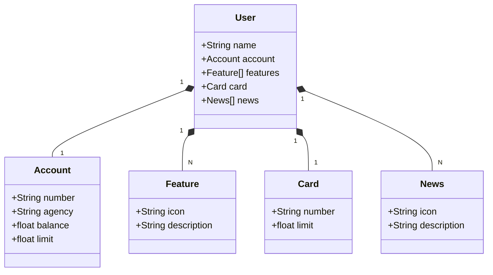

# Explorando um Domínio Bancário
Projeto feito para o Santander DEV Week
API RESTful com Gradle, Spring Boot 3, Java 17 e Railway

## Diagrama de Classes

## UX/UI
O protótipo foi fornecido pelo professor Venilton Falvo Jr >> [Figma](https://www.figma.com/design/0ZsjwjsYlYd3timxqMWlbj/SANTANDER---Projeto-Web%2FMobile?node-id=0-1&t=z3yWlVnXLn2DUBLd-1)

## Teste
- Criar variável de ambiente no IntelliJ devido a configuração *.application-dev*, caso a configuração fosse sem *-dev* não haveria necessidade de configuração de variável de ambiente.
    - Acessar Configurações de execução em configurações de variáveis de ambiente e inserir:  **SPRING_PROFILES_ACTIVE=dev**
    - Acessar localhost/h2-console

## Produção 
- Criar variável de ambiente no IntelliJ devido a configuração *.application-prod*
    - Acessar Configurações de execução em configurações de variáveis de ambiente e inserir:  **SPRING_PROFILES_ACTIVE=prod**
    - No Railway ir em Project Settings > Shared Variables > production e inserir a variável **SPRING_PROFILES_ACTIVE=prod** 
Essa variável de produção precisa ser configurada na IDE da mesma forma que no ambiente de testes

